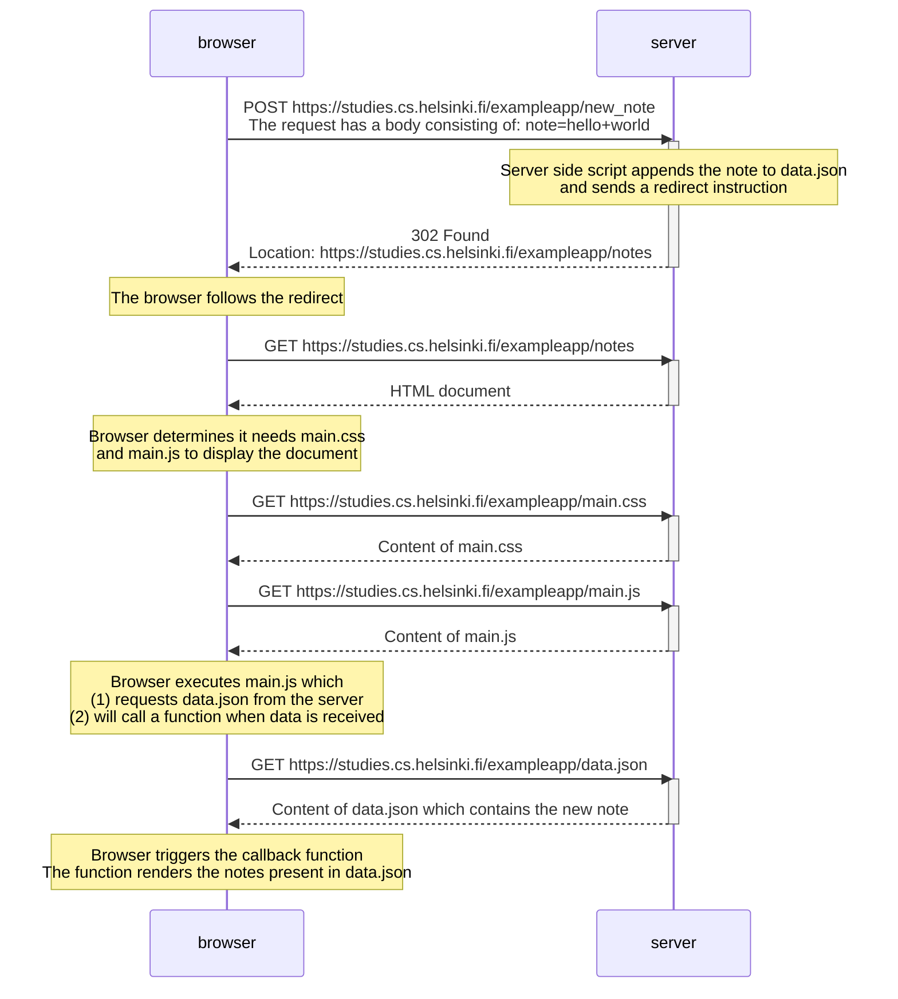

The user is on the page https://studies.cs.helsinki.fi/exampleapp/notes. The user writes "hello world" in the text box and clicks the submit button. The interaction between the browser and the server is as follows:

